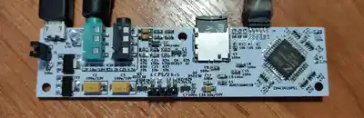
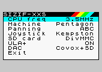

## Sizif-XXS
Smallest FPGA-based ZX Spectrum clone with real Z80.

### Tech specs
* 100x24.5mm PCB
* PS/2 keyboard
* Pentagon, Spectrum 128, Spectrum 48 and Spectrum +3e modes
* Altera EP1C3T100 FPGA
* Real Z80 in 3.5MHz, 4.4MHz, 5.2MHz, 7MHz modes
* 512K RAM
* TurboSound with switchable stereo ABC/ACB/mono output
* Integrated DivMMC and Z-Controller, 1x microSD socket
* PAL video output (AV cable like in Raspberry Pi)
* ULAplus
* Mono covox (Pentagon standard)
* SounDrive (4-channel stereo covox)
* Tape input via 3.5" jack
* USB 5V power supply

### Magic button
Sizif has a number of configurable parameters that you can change on the fly. To do this just hold Magic button for a second.

To navigate menu you can use up-down keys, to change value use enter or left-right keys. Kempston, Sinclair, Cursor and QAOP supported.

If you press Magic button for a short time, the standard NMI handler 'll be called.

### PS/2 keyboard buttons
| Button | Function |
| - | - |
| F5 | Magic menu button |
| F12 | Pause |
| Ctrl+Alt+Del | Reboot |
| Ctrl+Alt+Backspace | Reboot |
| Numpad 8, 2/5, 4, 6 | Joystick's up-down-left-right |
| Numpad 0/Enter | Joystick's fire |
| Alt | Joystick's fire |

### RAM
Sizif contains 512K RAM. 128K available via 7FFDh port, 128K via DFFDh (Profi standart, most compatible with old 128K software) and 128K used for DivMMC. Remaining space used to store ROM.  Note that DFFDh port available only in Pentagon mode.

### SD card
Sizif have preinstalled esxDOS firmware, which provides ability to load TAP, TRD, SCL, Z80 files and save snapshots. To use this you should format SD cart to FAT32 or FAT16 and unpack latest esxDOS release ([link](http://www.esxdos.org/index.html)) to card. Also it's recommended to install Long Filename Browser ([link](https://spectrumcomputing.co.uk/forums/viewtopic.php?t=2553)) to card.

### Changelog & current status
* Rev.A - first release. Please note the [errata](pcb/rev.A/ERRATA.txt).
* Rev.B:
    * fixed all rev.A issues
    * fixed "jailbars" on video output
    * 0805 footprints replaced with 0603
    * tape input moved slightly away to not to interfere with wide AV jack
    * 3.5 jacks replaced with THT variant for better reliability
    * changed ps/2 header orientation
